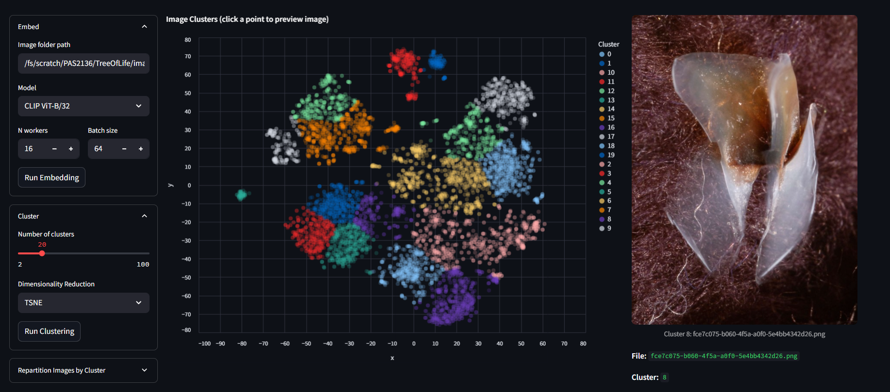
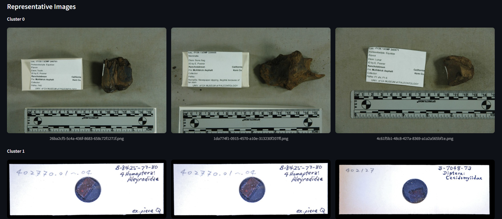

# emb-explorer

**emb-explorer** is a Streamlit-based visual exploration and clustering tool for image datasets.





---

## Features

* **Batch Image Embedding:**
  Efficiently embed large collections of images using the pretrained model (e.g., CLIP) on CPU or GPU (preferably), with customizable batch size and parallelism.
* **Clustering:**
  Reduces embedding vectors to 2D using PCA or T-SNE. Performs K-Means clustering and display result using a scatter plot. Explore clusters via interactive scatter plots. Click on data points to preview images and details.
* **Cluster-Based Repartitioning:**
  Copy/repartition images into cluster-specific folders with a single click. Generates a summary CSV for downstream use.
* **Clustering Summary:**
  Displays cluster sizes, variances, and representative images for each cluster, helping you evaluate clustering quality.
---

## Installation

Create a virtual environment with `uv` and install dependencies: 
```bash
uv venv .venv
source .venv/bin/activate
uv pip install -r requirements.txt
```
---

## Usage

```bash
# Activate virtual environment
source .venv/bin/activate 
# Host app
streamlit run app.py
```

---

---

## Acknowledgements

* [OpenAI CLIP](https://github.com/openai/CLIP)
* [Streamlit](https://streamlit.io/)
* [Altair](https://altair-viz.github.io/)

---

## License

TBD
---