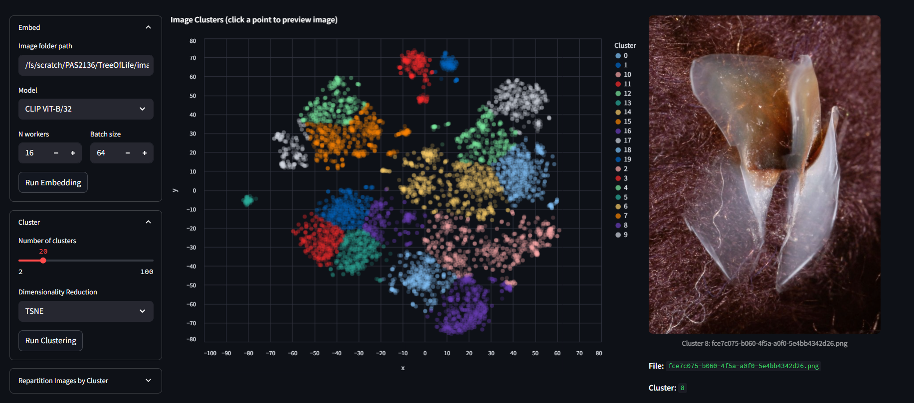
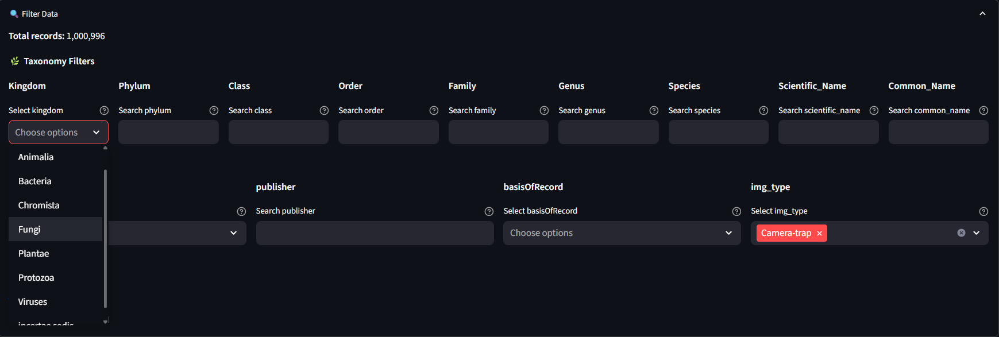
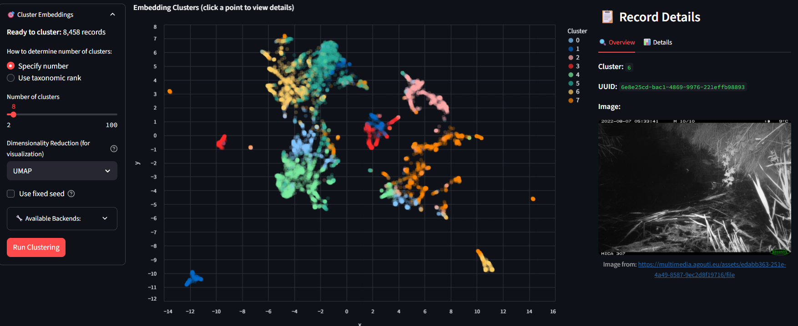
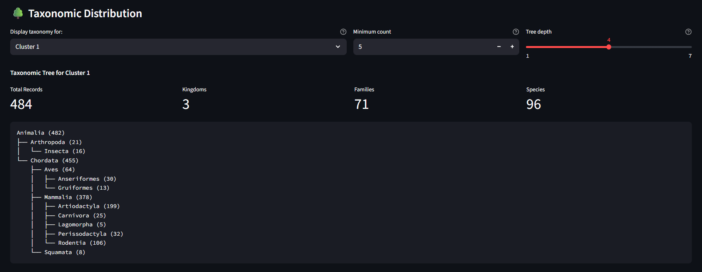

# emb-explorer

Visual exploration and clustering tool for image embeddings.

## Screenshots

<table>
  <tr>
    <td width="50%" align="center"><b>Embed & Explore</b></td>
    <td width="50%" align="center"><b>Precalculated Embeddings</b></td>
  </tr>
  <tr>
    <td></td>
    <td></td>
  </tr>
  <tr>
    <td></td>
    <td></td>
  </tr>
  <tr>
    <td></td>
    <td></td>
  </tr>
</table>

## Features

**Embed & Explore** - Embed images using pretrained models (CLIP, BioCLIP), cluster with K-Means, visualize with PCA/t-SNE/UMAP, and repartition images by cluster.

**Precalculated Embeddings** - Load parquet files with precomputed embeddings, apply dynamic cascading filters, and explore clusters with taxonomy tree navigation.

## Installation

```bash
git clone https://github.com/Imageomics/emb-explorer.git
cd emb-explorer

# Using uv (recommended)
uv venv && source .venv/bin/activate
uv pip install -e .

# GPU support (CUDA 12.0+ required)
uv pip install -e ".[gpu]"
```

## Usage

### Standalone Apps

```bash
# Embed & Explore - Interactive image embedding and clustering
streamlit run apps/embed_explore/app.py

# Precalculated Embeddings - Explore precomputed embeddings from parquet
streamlit run apps/precalculated/app.py
```

### Entry Points (after pip install)

```bash
emb-embed-explore    # Launch Embed & Explore app
emb-precalculated    # Launch Precalculated Embeddings app
list-models          # List available embedding models
```

### Example Data

An example dataset (`data/example_1k.parquet`) is provided with BioCLIP 2 embeddings for testing.

### Remote HPC Usage

```bash
# On compute node
streamlit run apps/precalculated/app.py --server.port 8501

# On local machine (port forwarding)
ssh -N -L 8501:<COMPUTE_NODE>:8501 <USER>@<LOGIN_NODE>

# Access at http://localhost:8501
```

## Acknowledgements

[OpenCLIP](https://github.com/mlfoundations/open_clip) | [Streamlit](https://streamlit.io/) | [Altair](https://altair-viz.github.io/)
