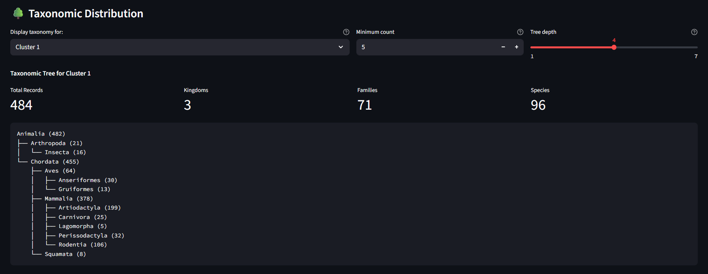

# emb-explorer

**emb-explorer** is a Streamlit-based visual exploration and clustering tool for image datasets and pre-calculated image embeddings. 

## 🎯 Demo Screenshots

<table>
  <tr>
    <td width="50%" align="center">
      <h3>📊 Embed & Explore Images</h3>
    </td>
    <td width="50%" align="center">
      <h3>🔍 Explore Pre-calculated Embeddings</h3>
    </td>
  </tr>
  <tr>
    <td width="50%">
      <h4>Embedding Interface</h4>
      
      <p><em>Embed your images using pre-trained models</em></p>
    </td>
    <td width="50%">
      <h4>Smart Filtering</h4>
      
      <p><em>Apply filters to pre-calculated embeddings</em></p>
    </td>
  </tr>
  <tr>
    <td width="50%">
      <h4>Cluster Summary</h4>
      
      <p><em>Analyze clustering results and representative images</em></p>
    </td>
    <td width="50%">
      <h4>Interactive Exploration</h4>
      
      <p><em>Explore clusters with interactive visualization</em></p>
    </td>
  </tr>
  <tr>
    <td width="50%">
      <!-- Empty cell for Page 1 -->
    </td>
    <td width="50%">
      <h4>Taxonomy Tree Navigation</h4>
      
      <p><em>Browse hierarchical taxonomy structure</em></p>
    </td>
  </tr>
</table>


## Features

### Embed & Explore Images from Upload

* **Batch Image Embedding:**
  Efficiently embed large collections of images using the pretrained model (e.g., CLIP, BioCLIP) on CPU or GPU (preferably), with customizable batch size and parallelism. 
* **Clustering:**
  Reduces embedding vectors to 2D using PCA, T-SNE, and UMAP. Performs K-Means clustering and display result using a scatter plot. Explore clusters via interactive scatter plots. Click on data points to preview images and details.
* **Cluster-Based Repartitioning:**
  Copy/repartition images into cluster-specific folders with a single click. Generates a summary CSV for downstream use.
* **Clustering Summary:**
  Displays cluster sizes, variances, and representative images for each cluster, helping you evaluate clustering quality.

### Explore Pre-computed Embeddings

* **Parquet File Support:**
  Load precomputed embeddings with associated metadata from parquet files. Compatible with various embedding formats and metadata schemas.
* **Advanced Filtering:**
  Filter datasets by taxonomic hierarchy, source datasets, and custom metadata fields. Combine multiple filter criteria for precise data selection.
* **Clustering:**
  Reduces embedding vectors to 2D using PCA and UMAP. Performs K-Means clustering and display result using a scatter plot. Explore clusters via interactive scatter plots. Click on points to preview images and explore metadata details.
* **Taxonomy Tree Navigation:**
  Browse hierarchical biological classifications with interactive tree view. Expand and collapse taxonomic nodes to explore at different classification levels.

## Installation

[uv](https://docs.astral.sh/uv/) is a fast Python package installer and resolver. Install `uv` first if you haven't already:

```bash
# Install uv (if not already installed)
curl -LsSf https://astral.sh/uv/install.sh | sh
```

Then install the project:

```bash
# Clone the repository
git clone https://github.com/Imageomics/emb-explorer.git
cd emb-explorer

# Create virtual environment and install dependencies
uv venv
source .venv/bin/activate  # On Windows: .venv\Scripts\activate
uv pip install -e .
```

### GPU Support (Optional)

For GPU acceleration, you'll need CUDA 12.0+ installed on your system.

```bash
# Full GPU support with RAPIDS (cuDF + cuML)
uv pip install -e ".[gpu]"

# Minimal GPU support (PyTorch + FAISS only)
uv pip install -e ".[gpu-minimal]"
```

### Development

```bash
# Install with development tools
uv pip install -e ".[dev]"
```

## Usage

### Running the Application

```bash
# Activate virtual environment (if not already activated)
source .venv/bin/activate  # On Windows: .venv\Scripts\activate

# Run the Streamlit app
streamlit run app.py
```

### Command Line Tools

The project also provides command-line utilities:

```bash
# List all available models
python list_models.py --format table

# List models in JSON format
python list_models.py --format json --pretty

# List models as names only
python list_models.py --format names

# Get help for the list models command
python list_models.py --help
```

### Running on Remote Compute Nodes

If running the app on a remote compute node (e.g., HPC cluster), you'll need to set up port forwarding to access the Streamlit interface from your local machine.

1. **Start the app on the compute node:**
   ```bash
   # On the remote compute node
   streamlit run app.py
   ```
   Note the port number (default is 8501) and the compute node hostname.

2. **Set up SSH port forwarding from your local machine:**
   ```bash
   # From your local machine
   ssh -N -L 8501:<COMPUTE_NODE>:8501 <USERNAME>@<LOGIN_NODE>
   ```
   
   **Example:**
   ```bash
   ssh -N -L 8501:c0828.ten.osc.edu:8501 username@cardinal.osc.edu
   ```
   
   Replace:
   - `<COMPUTE_NODE>` with the actual compute node hostname (e.g., `c0828.ten.osc.edu`)
   - `<USERNAME>` with your username
   - `<LOGIN_NODE>` with the login node address (e.g., `cardinal.osc.edu`)

3. **Access the app:**
   Open your web browser and navigate to `http://localhost:8501`

The `-N` flag prevents SSH from executing remote commands, and `-L` sets up the local port forwarding.


## Acknowledgements

* [OpenCLIP](https://github.com/mlfoundations/open_clip)
* [Streamlit](https://streamlit.io/)
* [Altair](https://altair-viz.github.io/)

---